# Przewodnik uczestnika: jak przejść przez warsztat

**„Od pytania do agenta”** · Databricks · SQLDay Lite · 09:00–18:00 · prowadzą Krzysztof i Mariusz

Przez cały dzień budujesz asystenta AI dla fikcyjnej firmy **TechRetail Corp**. Na koniec dnia ten sam wzorzec przenosisz na inne dane i wychodzisz z działającym mini-agentem.

**Cel dnia (karta wyjściowa):** agent na danych innych niż TechRetail i jego macierz 3 tras, z co najmniej dwiema trasami zgodnymi.

---

## Oś czasu dnia

```mermaid
gantt
    title Warsztat „Od pytania do agenta”
    dateFormat HH:mm
    axisFormat %H:%M
    section Rano
    M0 Start, setup, Canvas            :m0, 09:00, 45m
    M1 Agentic AI i Playground         :m1, after m0, 55m
    Przerwa                            :crit, b1, after m1, 15m
    M2 Tool calling (funkcje UC)       :m2, after b1, 70m
    section Po południu
    Lunch                              :crit, l, after m2, 60m
    M3 RAG i AI Search                 :m3, after l, 80m
    Przerwa                            :crit, b2, after m3, 15m
    M4 SQL, Genie, kontrola dostępu    :m4, after b2, 50m
    Przerwa                            :crit, b3, after m4, 10m
    M5 Agent end-to-end                :m5, after b3, 60m
    Przerwa                            :crit, b4, after m5, 10m
    M5+ Capstone w parach              :m5b, after b4, 40m
    M6 MCP, bezpieczeństwo, zamknięcie :m6, after m5b, 30m
```



Godziny są orientacyjne. Prowadzący dopasowują tempo do sali, więc notebooki nie podają czasu.

| Godzina | Moduł | Otwierasz | Na koniec modułu masz |
|---|---|---|---|
| 09:00 | **M0** Start | `00_setup/00_setup` | preflight z samymi ✅, Canvas z domeną i 5 pytaniami |
| 09:45 | **M1** Agentic AI i AI Playground | `labs/m1_agentic_ai_playground` | 4 odpowiedzi modelu bez narzędzi (punkt odniesienia na M5) |
| 10:55 | **M2** Tool calling | `labs/m2_tool_calling` | 3 funkcje Unity Catalog przetestowane payloadem |
| 13:05 | **M3** RAG i AI Search | `labs/m3_rag_ai_search` | RAG z cytatami `[raport #fragment]` |
| 14:40 | **M4** SQL, Genie, dostęp | `labs/m4_sql_genie_governance` | Genie Agent, maska na `tax_id`, **zdjęty filtr i maska** |
| 15:40 | **M5** Agent end-to-end | `labs/m5_end_to_end_agent` | agent z 4 narzędziami i macierz 6 tras |
| 16:50 | **M5+** Przenieś wzorzec | `labs/m5b_transfer_capstone` | **karta wyjściowa**: macierz 3 tras na nowych danych |
| 17:30 | **M6** MCP i bezpieczeństwo | `labs/m6_mcp_security_next_steps` | wywołanie Twojej funkcji przez MCP, plan „co dalej” |

---

## Przed warsztatem

### Tydzień przed
1. **Załóż konto Databricks Free Edition.** Wystarczy konto Google, Microsoft albo e-mail.

### Dzień przed
2. **Zaimportuj repozytorium jako folder Git:** **Workspace → Home → Create → Git folder**, wklej adres repozytorium z zaproszenia, **Create Git folder**.
3. Sprawdź, że widzisz `workshop/` z katalogami `00_setup`, `labs`, `demo`, `pattern`, `transfer`, `data`.
4. **Test:** otwórz `workshop/00_setup/00_setup` i uruchom tylko pierwszą komórkę (`%pip install`). Jeśli skończyła się bez błędu, jesteś gotowy.

> Folder musi być **folderem Git**. Zwykłe wgranie plików nie przeniesie danych z `workshop/data/`, a notebooki czytają je ścieżką względną.

### Rano, przed 09:00
5. Zaloguj się do workspace i otwórz `00_setup`. Laptop podłączony do prądu, jedna karta przeglądarki na workspace, druga na ten przewodnik.

---

## Jak pracujemy w każdym module

```
problem z historii TechRetail  →  wzorzec na innych danych (prowadzący)  →  Twój lab  →  karta wzorca + wiersz w Canvasie
```

| Poziom | Dla kogo | Gdzie w labie |
|---|---|---|
| **1. Ścieżka** | wszyscy | komórki `ZADANIE` z `TODO` (zastąp `...` swoim kodem) |
| **2. Transfer** | kto skończy ścieżkę | komórki `POZIOM 2`: ten sam krok na danych Bakehouse |
| **3. Wyzwanie** | kto chce więcej | sekcja „Poziomy 2 i 3”: wyzwanie dla zaawansowanych |

**Każdy notebook zaczyna się tak samo:** `%pip install` → `restartPython` → **komórka konfiguracji**. Po każdym restarcie Pythona uruchom ponownie komórkę konfiguracji i kolejne komórki w dół.

**Canvas agenta** (`workshop/transfer/canvas_agenta.md`): jedna strona, uzupełniana przez cały dzień. Po każdym module dopisujesz jeden wiersz. Na capstone przepisujesz go do kodu.

---

## Moduł po module

### 09:00 · M0 · Start: dane w Twoim workspace
**Otwierasz:** `00_setup/00_setup` → **Run all**, a w trakcie czytasz wstęp.

1. Notebook tworzy tabelę `gold_customer_360` (28 813 klientów), Volume z 10 raportami PDF, tabelę fragmentów raportów i uruchamia w tle endpoint AI Search.
2. Sprawdź tabelę preflight na końcu: SQL, fragmenty, model, tracing, AI Search, Bakehouse. Endpoint AI Search może jeszcze pokazywać `PROVISIONING`; to normalne.
3. **Lab „poznaj dane”:** kilka zapytań do tabeli, zanim zapytasz o nie model.
4. **Canvas:** wpisz swoją domenę i 5 pytań, które zadaliby jej użytkownicy.

**Masz:** preflight z ✅ i wypełniony początek Canvasu.

### 09:45 · M1 · Agentic AI i AI Playground
**Otwierasz:** `labs/m1_agentic_ai_playground`

1. Chatbot, RAG i agent: czym się różnią.
2. **ZADANIE 1:** zbuduj listę wiadomości (system prompt + pytanie) i zadaj 4 pytania testowe: w domenie, poza domeną, o dane osobowe i jailbreak.
3. **ZADANIE 2** (opcjonalnie): usuń jedno zdanie z system promptu i porównaj odpowiedzi.
4. **AI Playground:** ten sam prompt bez kodu, dwa modele obok siebie.

**Zwróć uwagę:** sam model z dobrym promptem potrafi **zmyślić liczby**. Twoje odpowiedzi zapisują się w `m1_baseline_answers` i wrócą w M5.
**Canvas:** system prompt dla Twojej domeny.

### 10:55 · M2 · Tool calling: model wywołuje Twoje funkcje
**Otwierasz:** `labs/m2_tool_calling` · **Wzorzec:** funkcje UC na danych Bakehouse (demo prowadzącego)

1. **ZADANIE 3:** opis (`COMMENT`) i filtr funkcji SQL `get_revenue_summary`. Opis decyduje, **kiedy** model użyje narzędzia.
2. **ZADANIE 4** (poziom 2): opis narzędzia w JSON Schema i tool calling „ręcznie” w czterech krokach.
3. Dwie kolejne funkcje: `get_average_customer_value` i `get_customer_profile`, która **nie zwraca** danych osobowych.
4. **ZADANIE 5:** docstring funkcji Python `format_customer_for_agent`.
5. **Test payloadem:** wywołaj funkcje bez modelu dokładnie z tym, co dostałby agent. Zapamiętaj numer **klienta X**.
6. **AI Playground:** dodaj funkcje jako Tools i sprawdź, którą wybiera model.

**Poziom 2:** funkcja `bh_payment_methods` na danych Bakehouse.
**Masz:** 3 funkcje UC i wynik testu payloadem. **Canvas:** 1–2 funkcje dla Twojej domeny.

### 13:05 · M3 · RAG jako narzędzie: raporty i AI Search
**Otwierasz:** `labs/m3_rag_ai_search` · **Wzorzec:** RAG na artykułach o robotyce (demo prowadzącego)

1. Od PDF do tekstu: `ai_parse_document`. Domyślnie `RUN_PARSE = False` wczytuje gotowy wynik. **ZADANIE 6** jest na poziomie 2.
2. **ZADANIE 7:** chunking. Porównaj 600/100, 2000/0 i 300/50 i zobacz, jak zmienia się liczba fragmentów.
3. **ZADANIE 8** (poziom 2): embeddingi i podobieństwo kosinusowe czterech zdań.
4. Indeks AI Search. Jeśli endpoint nie jest gotowy, notebook sam przechodzi w **tryb offline** na tych samych danych.
5. **ZADANIE 9:** RAG z cytatami. Kontekst z nagłówkami `[raport #fragment]` i instrukcja „odpowiadaj tylko z fragmentów”.
6. Tryby wyszukiwania ANN, HYBRID i FULL_TEXT oraz filtr po raporcie.
7. **AI Playground:** indeks jako Tool. Prowadzący pokazuje ten sam RAG bez kodu w Knowledge Assistant.

**Poziom 2:** RAG na opiniach klientów Bakehouse.
**Masz:** `custom_rag` z cytatami. **Canvas:** Twoje dokumenty, rozmiar fragmentu, metadane.

### 14:40 · M4 · SQL, Genie Agent i kontrola dostępu
**Otwierasz:** `labs/m4_sql_genie_governance`

1. **ZADANIE 10:** dwa zapytania SQL z oczekiwanym wynikiem (np. 9 541 klientów VIP).
2. **Genie Agent w UI:** zadaj te same pytania po polsku i porównaj wygenerowany SQL z własnym. Jeśli Genie poda inną liczbę, sprawdź, jak zdefiniował „klienta”.
3. **Row filter** (demo prowadzącego): te same zapytania zwracają mniej wierszy.
4. **ZADANIE 11:** maska kolumny `tax_id` (`CASE`).
5. **Sprawdź w Genie:** polityka działa w każdym interfejsie.
6. **Obowiązkowo:** komórka sprzątająca zdejmuje filtr i maskę. **Bez tego M5 nie ruszy.**

**Poziom 2:** maska na numerze karty w kopii danych Bakehouse.
**Masz:** ✅ z komórki sprzątającej (28 813 wierszy, `tax_id` bez maski). **Canvas:** dane wrażliwe i decyzja: maska czy filtr.

### 15:40 · M5 · Agent end-to-end
**Otwierasz:** `labs/m5_end_to_end_agent` · **Demo w duecie:** agent w trace i w Databricks Apps

1. Tracing przed agentem: od teraz każde wywołanie zostawia ślad w MLflow.
2. **ZADANIE 12:** agent z 4 narzędziami (3 funkcje + RAG). Kluczowe jest zdanie w opisie RAG, **do czego go nie używać**.
3. **Macierz tras:** 6 pytań i 6 oczekiwanych tras (funkcja, RAG, oba, odmowa PII, fallback, szkodliwe). Wynik to np. „trasy zgodne 5/6”.
4. **ZADANIE 13:** Twoje pytanie i oczekiwana trasa.
5. **Pętla poprawy w parach:** test → ślad → **jedna** zmiana → test.
6. Opcjonalnie: sędzia LLM, `ResponsesAgent`, porównanie z odpowiedziami z M1.

**Zwróć uwagę:** macierz tras może się różnić między uruchomieniami. Porównuj, **które** trasy się zgadzają, a nie jedną liczbę.
**Masz:** macierz tras. **Canvas:** macierz 3–5 tras dla Twojej domeny.

### 16:50 · M5+ · Przenieś wzorzec (capstone, w parach)
**Otwierasz:** `labs/m5b_transfer_capstone`

1. **Wybierz dane** (`DATA_OPTION`): `"bakehouse"` (domyślnie) albo `"airbnb"` (zbiór zapasowy).
2. **ZADANIE C1:** przepisz Canvas do kodu: domena, system prompt, 3 trasy.
3. **ZADANIE C2:** jedna funkcja UC z `COMMENT` na Twojej tabeli i test bez modelu.
4. (Jeśli masz tekst) wyszukiwanie w tekście jako drugie narzędzie.
5. Agent i macierz 3 tras.
6. **Karta wyjściowa:** zrzut ekranu macierzy i zdanie „wzorzec, który przeniosłem, to…”. Trzy pary pokazują wynik.

**Masz:** kartę wyjściową, czyli cel dnia.

### 17:30 · M6 · MCP, bezpieczeństwo i dalszy rozwój
**Otwierasz:** `labs/m6_mcp_security_next_steps`

1. MCP: agent jako klient, narzędzia jako serwery. Zarządzane serwery Databricks nie wymagają kodu po stronie serwera.
2. **ZADANIE 14:** lista narzędzi z serwera funkcji i wywołanie `get_customer_profile` przez MCP. Na liście zobaczysz też **swoją funkcję z capstone**.
3. Demo: agent z narzędziami z 3 serwerów MCP (funkcje, AI Search, Genie).
4. Ryzyka agentów, sześć warstw obrony i least privilege.
5. **Karta wzorca:** czego brakuje, żeby z prototypu zrobić PoC na Twoich danych.

---

## Gdy utkniesz

| Krok | Co zrobić |
|---|---|
| 1 | Przeczytaj komunikat błędu do końca: zwykle mówi, której komórki brakuje. |
| 2 | Uruchom ponownie **komórkę konfiguracji** i komórki w dół. |
| 3 | Zapytaj sąsiada z pary. |
| 4 | **Po 2 minutach** czerwona karteczka na laptopie: ktoś z prowadzących podejdzie. |
| 5 | Skopiuj rozwiązanie z tej samej komórki w `workshop/demo/` i idź dalej. To nie porażka, tylko sposób, żeby nie zgubić wątku. |

| Objaw | Rozwiązanie |
|---|---|
| `NameError` po restarcie | uruchom komórkę konfiguracji i kolejne |
| Endpoint AI Search `PROVISIONING` | nic nie rób: M3 i M5 działają w trybie offline |
| `429` / „czekam N s…” przy modelu | limit zapytań jest wspólny dla sali; komórka poczeka sama, nie uruchamiaj jej kilka razy |
| M5: „tabela ma … wierszy” | uruchom komórkę sprzątającą z M4 |
| M6: błąd serwera MCP | ustaw `TRY_MCP = False` i obejrzyj demo prowadzącego |
| Brak `samples.bakehouse` na capstone | `DATA_OPTION = "airbnb"` |

Więcej: `workshop/docs/cheat_sheet_free_vs_premium.md`.

---

## Po warsztacie

1. **Usuń endpoint AI Search** (**Compute → AI Search**), jeśli nie wracasz do labów w najbliższych dniach. Zużywa kwotę Free Edition także bez zapytań.
2. Rozwiązania wszystkich labów są w `workshop/demo/`.
3. Twój Canvas i notebook z capstone to gotowa specyfikacja PoC na Twoich danych.
4. Dalsza droga: karta wzorca w M6 i materiały źródłowe prowadzących w `Warsztaty_Mariusz/` (ewaluacja, monitoring, wdrożenie) oraz `Warsztaty_Krzysztof/` (RAG, agent w Databricks Apps).
